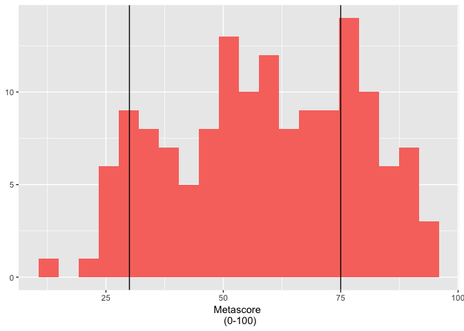

Replication of the Movie Rating
================

``` r
library(ggplot2)
library(gridExtra)
library(scales)
library(plyr)
library(reshape2)
library(psych)

set.seed(123457)
data = rnorm(1000000, mean = 0, sd = 1)
data = as.data.frame(data)
library(ggplot2)
library(gridExtra)
ggplot(data, aes(x = data, fill = "red")) +
  geom_histogram(bins=29) +
  geom_vline(xintercept=c(-1.75, 1.75)) +
  annotate("text", label = "Few value are low,", x = -3.5, y = 75000) +
  annotate("text", label = "and few are extremely low", x = -3.4, y = 70000) +
  annotate("text", label = "Few value are high", x = 3.5, y = 75000) +
  annotate("text", label = "and few are extremely high", x = 3.4, y  = 70000) +
  annotate("text", label = "The tallest bars are here", x = 0, y = 150000) +
  annotate("text", label = "It means most of the values are average", x = 0, y = 145000) +
  labs(title = "Meet The Normal Distribution", x = "Values", y = "Number Of Values(Frequency)") +
  theme(legend.position = 'none')
```


``` r
# Values for hists
bad = c(0,0,0,1,1,1,1,1,1,1,1,1,2,2,2,2,2,3,3,3,4,4,5,5,6)
average = c(0,1,1,2,2,2,2,2,3,3,3,3,3,3,3,3,3,4,4,4,4,4,5,5,6)
good = c(0,1,1,2,2,3,3,3,4,4,4,4,4,5,5,5,5,5,5,5,5,5,5,6)
uniform = c(0,0,0,0,1,1,1,1,1,2,2,2,2,3,3,3,3,4,4,4,4,4,5,5,5,5,6,6,6,6)

bad <- as.data.frame(bad)
average <- as.data.frame(average)
good <- as.data.frame(good)
uniform <- as.data.frame(uniform)

c = ggplot(bad, aes(x = bad, fill = "red")) +
  geom_histogram(bins = 7) + 
  annotate("text", label = "Cluster in the Low", x = 4, y = 7.5) +
  annotate("text", label = "Ratings Area(likely)", x = 4, y = 6.7) +
  geom_segment(aes(x = 2.5, xend = 1.6, y = 7.5, yend = 7.5), arrow = arrow(length = unit(0.2, "cm"))) +
  theme(legend.position = 'none',
        axis.title = element_blank(),
        axis.text.x = element_blank(),
        axis.ticks.x = element_blank(),
        axis.text.y = element_blank(),
        axis.ticks.y = element_blank())

b = ggplot(average, aes(x = average, fill = "red")) +
  geom_histogram(bins = 7) + 
  annotate("text", label = "Cluster in the", x = 5.4, y = 7.5) +
  annotate("text", label = "Average Ratings", x = 5.4, y = 6.7) +
  annotate("text", label = "Area(Very Likely)", x = 5.4, y = 5.9) + 
  geom_segment(aes(x = 4.3, xend = 3.5, y = 7.5, yend = 7.5), arrow = arrow(length = unit(0.2, "cm"))) +
  theme(legend.position = 'none',
        axis.title = element_blank(),
        axis.text.x = element_blank(),
        axis.ticks.x = element_blank(),
        axis.text.y = element_blank(),
        axis.ticks.y = element_blank())

a = ggplot(good, aes(x = good, fill = "red")) +
  geom_histogram(bins = 7) + 
  annotate("text", label = "Cluster in the High", x = 2, y = 7.5) +
  annotate("text", label = "Ratings Area(likely)", x = 2, y = 6.7) +
  geom_segment(aes(x = 3.6, xend = 4.5, y = 7.5, yend = 7.5), arrow = arrow(length = unit(0.2, "cm"))) +
  theme(legend.position = 'none',
        axis.title = element_blank(),
        axis.text.x = element_blank(),
        axis.ticks.x = element_blank(),
        axis.text.y = element_blank(),
        axis.ticks.y = element_blank())

d = ggplot(uniform, aes(x = uniform, fill = "red")) +
  geom_histogram(bins = 7) + 
  annotate("text", label = "No Prominent Clusters", x = 3, y = 7.5) +
  annotate("text", label = "Unlikely", x = 3, y = 6.7) +
  theme(legend.position = 'none',
        axis.title = element_blank(),
        axis.text.x = element_blank(),
        axis.ticks.x = element_blank(),
        axis.text.y = element_blank(),
        axis.ticks.y = element_blank())

grid.arrange(a, b, c, d, ncol = 2, top="Four Possible Distributions of The Ratings For a Single Movie")
```


IMDB, Rotten Tomatoes, Fandango Or Metacritic?
----------------------------------------------

``` r
new_ds = read.csv("~/Desktop/Opendata/Data_science/replication/movie_ratings_16_17.csv")
head(new_ds)
```

    ##                     movie year metascore imdb tmeter audience fandango
    ## 1     10 Cloverfield Lane 2016        76  7.2     90       79      3.5
    ## 2                13 Hours 2016        48  7.3     50       83      4.5
    ## 3     A Cure for Wellness 2016        47  6.6     40       47      3.0
    ## 4         A Dog's Purpose 2017        43  5.2     33       76      4.5
    ## 5 A Hologram for the King 2016        58  6.1     70       57      3.0
    ## 6         A Monster Calls 2016        76  7.5     87       84      4.0
    ##   n_metascore n_imdb n_tmeter n_audience nr_metascore nr_imdb nr_tmeter
    ## 1        3.80   3.60     4.50       3.95          4.0     3.5       4.5
    ## 2        2.40   3.65     2.50       4.15          2.5     3.5       2.5
    ## 3        2.35   3.30     2.00       2.35          2.5     3.5       2.0
    ## 4        2.15   2.60     1.65       3.80          2.0     2.5       1.5
    ## 5        2.90   3.05     3.50       2.85          3.0     3.0       3.5
    ## 6        3.80   3.75     4.35       4.20          4.0     4.0       4.5
    ##   nr_audience
    ## 1         4.0
    ## 2         4.0
    ## 3         2.5
    ## 4         4.0
    ## 5         3.0
    ## 6         4.0

``` r
a = ggplot(new_ds, aes(x = imdb, fill = "red")) +
  geom_histogram(bins = 20) +
  geom_vline(xintercept=c(3, 7)) +
  labs(x = 'IMDB \n(0-10)') +
  theme(legend.position = 'none',
        axis.title.y = element_blank())

b = ggplot(new_ds, aes(x = fandango, fill = "red")) +
  geom_histogram(bins = 7) +
  geom_vline(xintercept=c(1.5, 3.5)) +
  labs(x = 'Fandango \n (0-5 Stars)') +
  theme(legend.position = 'none',
        axis.title.y = element_blank())

c = ggplot(new_ds, aes(x = metascore, fill = "red")) +
  geom_histogram(bins = 20) +
  geom_vline(xintercept=c(30, 75)) +
  labs(x = 'Metascore \n (0-100)') +
  theme(legend.position = 'none',
        axis.title.y = element_blank())

d = ggplot(new_ds, aes(x = tmeter, fill = "red")) +
  geom_histogram(bins = 20) +
  geom_vline(xintercept=c(30, 70)) +
  labs(x = 'Tomatometer \n(0-100%)') +
  theme(legend.position = 'none',
        axis.title.y = element_blank())

grid.arrange(a, b, c, d, ncol = 2, top="Looking For Something Normal")
```


``` r
ds = read.csv("~/Desktop/Opendata/Data_science/replication/movie_metadata.csv")

#remove na
ds = na.omit(ds)

ggplot(ds, aes(x = ds$imdb_score, fill = "red")) +
  geom_histogram(bins = 20) +
  geom_vline(xintercept=c(3, 7)) +
  labs(title = "The Distribution For 4917 IMDB Movie Ratings Mirrors \nThe One Above" ,x = 'Rating') +
  theme(legend.position = 'none',
        axis.title.y = element_blank())
```


``` r
fte_ds = read.csv("~/Desktop/Opendata/Data_science/replication/fandango_score_comparison.csv")
head(fte_ds)
```

    ##                             FILM RottenTomatoes RottenTomatoes_User
    ## 1 Avengers: Age of Ultron (2015)             74                  86
    ## 2              Cinderella (2015)             85                  80
    ## 3                 Ant-Man (2015)             80                  90
    ## 4         Do You Believe? (2015)             18                  84
    ## 5  Hot Tub Time Machine 2 (2015)             14                  28
    ## 6       The Water Diviner (2015)             63                  62
    ##   Metacritic Metacritic_User IMDB Fandango_Stars Fandango_Ratingvalue
    ## 1         66             7.1  7.8            5.0                  4.5
    ## 2         67             7.5  7.1            5.0                  4.5
    ## 3         64             8.1  7.8            5.0                  4.5
    ## 4         22             4.7  5.4            5.0                  4.5
    ## 5         29             3.4  5.1            3.5                  3.0
    ## 6         50             6.8  7.2            4.5                  4.0
    ##   RT_norm RT_user_norm Metacritic_norm Metacritic_user_nom IMDB_norm
    ## 1    3.70          4.3            3.30                3.55      3.90
    ## 2    4.25          4.0            3.35                3.75      3.55
    ## 3    4.00          4.5            3.20                4.05      3.90
    ## 4    0.90          4.2            1.10                2.35      2.70
    ## 5    0.70          1.4            1.45                1.70      2.55
    ## 6    3.15          3.1            2.50                3.40      3.60
    ##   RT_norm_round RT_user_norm_round Metacritic_norm_round
    ## 1           3.5                4.5                   3.5
    ## 2           4.5                4.0                   3.5
    ## 3           4.0                4.5                   3.0
    ## 4           1.0                4.0                   1.0
    ## 5           0.5                1.5                   1.5
    ## 6           3.0                3.0                   2.5
    ##   Metacritic_user_norm_round IMDB_norm_round Metacritic_user_vote_count
    ## 1                        3.5             4.0                       1330
    ## 2                        4.0             3.5                        249
    ## 3                        4.0             4.0                        627
    ## 4                        2.5             2.5                         31
    ## 5                        1.5             2.5                         88
    ## 6                        3.5             3.5                         34
    ##   IMDB_user_vote_count Fandango_votes Fandango_Difference
    ## 1               271107          14846                 0.5
    ## 2                65709          12640                 0.5
    ## 3               103660          12055                 0.5
    ## 4                 3136           1793                 0.5
    ## 5                19560           1021                 0.5
    ## 6                39373            397                 0.5

``` r
a = ggplot(fte_ds, aes(x = fte_ds$IMDB, fill = "red")) +
  geom_histogram(bins = 20) +
  geom_vline(xintercept=c(3, 7)) +
  labs(x = 'IMDB \n(0-10)') +
  theme(legend.position = 'none',
        axis.title.y = element_blank())
a
```


``` r
b = ggplot(fte_ds, aes(x = fte_ds$Fandango_Stars, fill = "red")) +
  geom_histogram(bins = 7) +
  geom_vline(xintercept=c(1.5, 3.5)) +
  labs(x = 'Fandango \n (0-5 Stars)') +
  theme(legend.position = 'none',
        axis.title.y = element_blank())

c = ggplot(fte_ds, aes(x = fte_ds$Metacritic, fill = "red")) +
  geom_histogram(bins = 20) +
  geom_vline(xintercept=c(30, 75)) +
  labs(x = 'Metascore \n (0-100)') +
  theme(legend.position = 'none',
        axis.title.y = element_blank())
c
```



``` r
d = ggplot(fte_ds, aes(x = fte_ds$RottenTomatoes , fill = "red")) +
  geom_histogram(bins = 20) +
  geom_vline(xintercept=c(30, 70)) +
  labs(x = 'Tomatometer \n(0-100%)') +
  theme(legend.position = 'none',
        axis.title.y = element_blank())
d
```


``` r
grid.arrange(a, b, c, d, ncol = 2, top="Different Movie, Same Story")
```


``` r
a = cor(new_ds$fandango, new_ds$imdb)
b = cor(new_ds$fandango, new_ds$metascore)

tibble::tibble(a,b)
```

    ## # A tibble: 1 x 2
    ##       a     b
    ##   <dbl> <dbl>
    ## 1 0.633 0.379

``` r
set.seed(123457)
data = rnorm(1000000, mean = 0, sd = 1)
data = as.data.frame(data)

ggplot(data, aes(x = data, fill = "red")) +
  geom_histogram(bins=29) +
  geom_vline(xintercept=c(-1.75, 1.75)) +
  annotate("text", label = "Few Movies Are", x = -3.5, y = 75000) +
  annotate("text", label = "Terrible", x = -3.4, y = 70000) +
  annotate("text", label = "Few Moviews Are", x = 3.5, y = 75000) +
  annotate("text", label = "Outstanding", x = 3.4, y = 70000) +
  annotate("text", label = "Most Of The Movies", x = 0, y = 150000) +
  annotate("text", label = "Are Average", x = 0, y = 145000) +
  labs(title = "Movie Ratings Should Reflect \nMovie Quality", x = "Rating Values") +
  theme(legend.position = 'none',
        axis.title.y = element_blank(),
        axis.ticks.y = element_blank())
```


